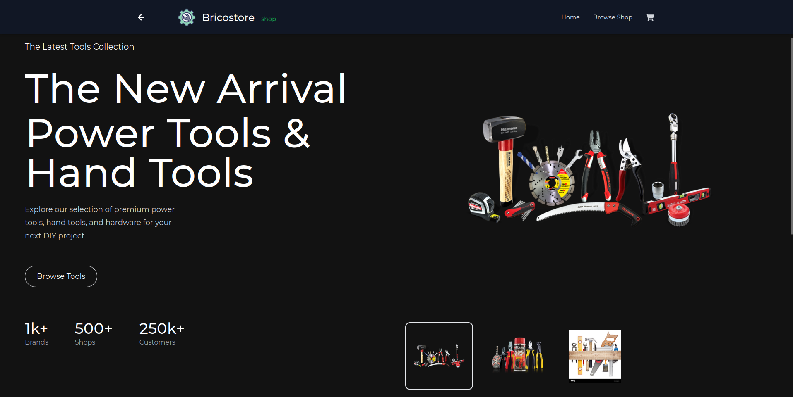
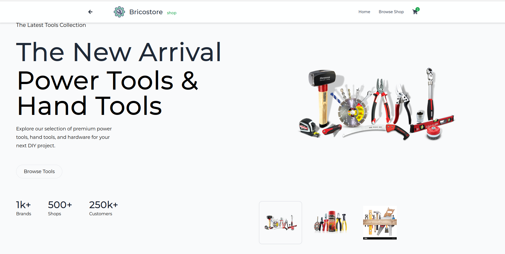
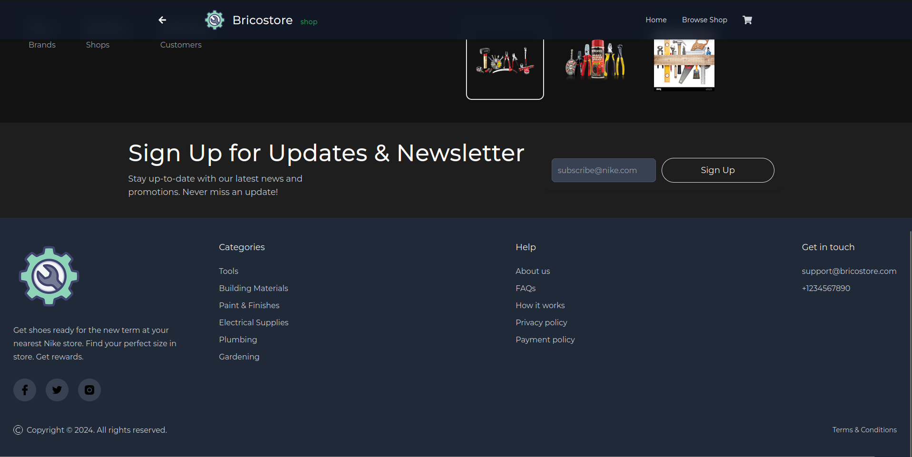
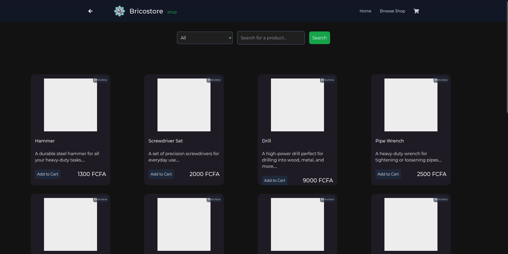
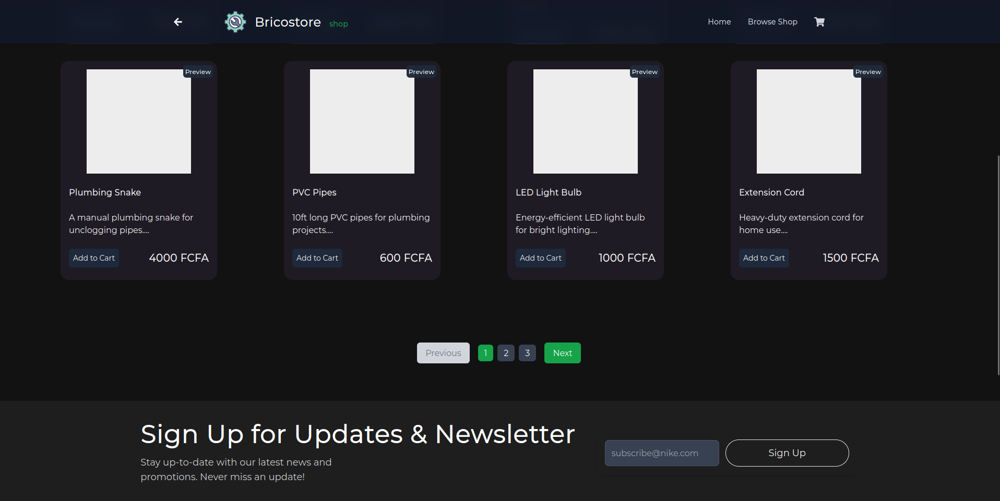
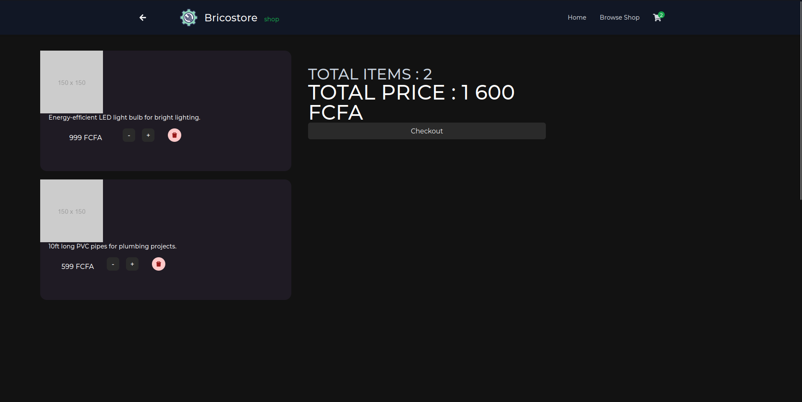
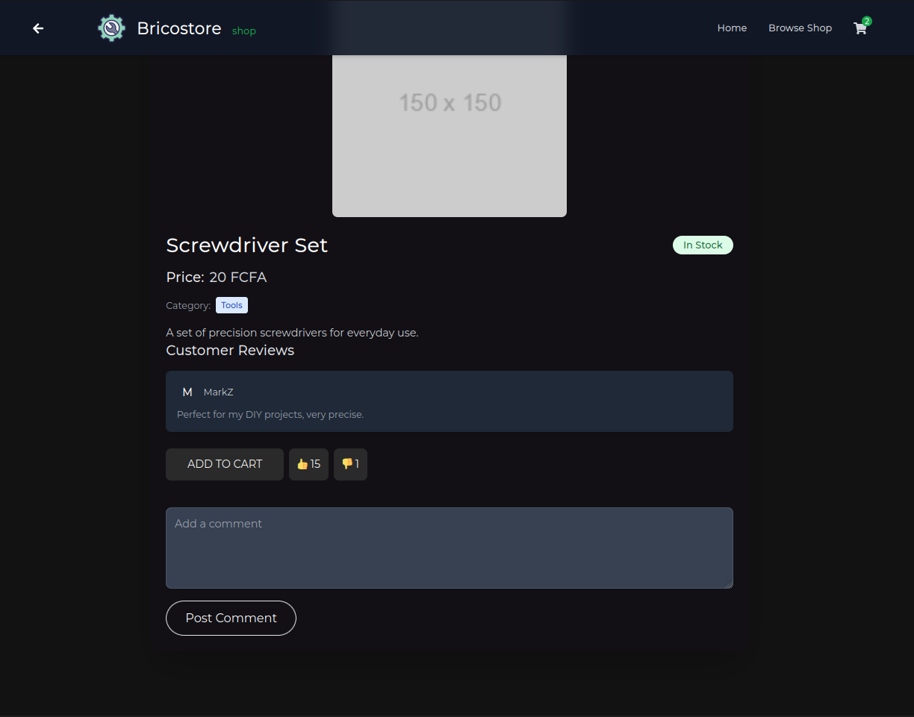

# Template React Magento

## Instructions pour le front-Template

1. Clonez le frontend en exécutant la commande suivante :

   ```bash
   git clone https://github.com/lado-saha/magento-front.git
   ```

2. Ensuite, exécutez les commandes suivantes pour installer les dépendances et démarrer le projet :

   ```bash
   cd magento-front
   npm install
   npm run dev
   ```

3. Ensuite, naviguez vers la page frontend : `localhost:5173`.

4. NB: The Magento backend is needed for perfect communication and visuals.

---

## Aperçu du Template

Voici un aperçu du template React Magento avec des captures d'écran modernes :

### Page d'accueil



### Page d'accueil (Light)



### Footer & Newsletter



### Produit et Recherche



### Checkout



### Pagination



### Details produit



---

